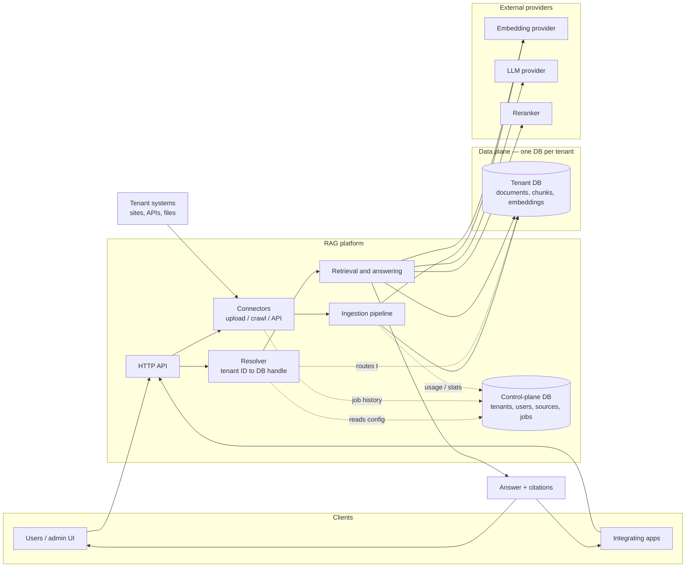

# Software Requirements Specification
## Multi-tenant Company Knowledge RAG Platform

| Field | Value |
|---|---|
| Document | SRS-001 |
| Version | 0.1 (draft) |
| Status | For review |
| Owner | Product / Architecture |

---

## 1. Introduction

### 1.1 Purpose
This document specifies the functional and non-functional requirements for a Retrieval-Augmented Generation (RAG) platform that lets users ask natural-language questions about a company and its products and receive grounded, cited answers. The platform supports many companies (tenants) whose data is ingested from heterogeneous sources and kept physically separated.

It is the source of truth from which technical specifications (SPEC-xx), architecture decision records (ADR-xxxx) and the delivery backlog (EPIC-xx, STORY-xx) are derived. Every requirement has a stable ID so it can be traced forward.

### 1.2 Scope
In scope:
- Enrolment and lifecycle management of tenants (companies).
- Ingestion of content from uploaded documents, third-party APIs and web pages.
- Per-tenant storage, indexing and retrieval of that content.
- A query interface that answers questions with citations.
- Administration of sources, users, credentials and jobs per tenant.
- Observability, auditing and usage accounting.

Out of scope for v1:
- End-user chat UI beyond a reference implementation.
- Fine-tuning of language models.
- Real-time streaming ingestion (webhooks / CDC) — planned for v2.
- Billing and payment processing (usage counters are in scope; invoicing is not).

### 1.3 Definitions
| Term | Meaning |
|---|---|
| Tenant | A company enrolled on the platform. Unit of data isolation. |
| Control plane | Shared database and services that manage tenants, users, sources and jobs. Holds no tenant content. |
| Data plane | Per-tenant database holding documents, chunks and embeddings. |
| Source | A configured instance of a connector (e.g. "Acme public docs crawl"). |
| Connector | Code that knows how to fetch content of a given kind (upload, web crawl, API…). |
| Document | A unit of source content (a PDF, a web page, an API record rendered to text). |
| Chunk | A segment of a document sized for embedding and retrieval. |
| Sync | A job that brings a source's content in the data plane up to date. |
| Resolver | Component that maps a tenant ID to its data-plane database handle. |

### 1.4 References
- SPEC-01 … SPEC-10 (docs/specs/)
- ADR-0001 … ADR-0008 (docs/adr/)
- schemas/control_plane.sql, schemas/tenant.sql

---

## 2. Overall description

### 2.1 Product perspective
The platform is a multi-tenant backend service exposed through an HTTP API and an admin interface. It integrates with:
- External embedding and LLM providers (hosted or self-hosted).
- Tenant-owned systems (REST/GraphQL APIs, websites, file stores).
- Identity providers for SSO (optional).

```
 Tenant systems ──► Connectors ──► Ingestion ──► Tenant DB (per company)
                                                      │
 Users / apps ──► API ──► Resolver ──► Retrieval ◄────┘──► LLM ──► Answer + citations
                          │
                   Control-plane DB
```



### 2.2 User classes
| Class | Description | Typical actions |
|---|---|---|
| Platform admin | Operates the platform across all tenants | Enrol / suspend / delete tenants, run migrations, view platform health |
| Tenant owner / admin | Manages one company's configuration | Add sources, manage members and API keys, trigger syncs, review jobs |
| Tenant editor | Maintains content | Upload documents, edit source config |
| Tenant viewer / end user | Consumes answers | Ask questions, browse citations |
| Integrating application | Programmatic consumer | Call query API with an API key |

### 2.3 Operating environment
- Linux containers orchestrated by Kubernetes or equivalent.
- PostgreSQL 16+ with pgvector for both control plane and data plane.
- Outbound HTTPS to embedding/LLM providers and tenant sources.
- Go 1.22+ services; optional Python 3.11+ parsing sidecar.

### 2.4 Design and implementation constraints
- C-1 Each tenant's content MUST reside in a dedicated database (ADR-0001).
- C-2 Primary implementation language is Go (ADR-0002).
- C-3 Tenant content MUST never be stored in the control plane.
- C-4 All secrets MUST be encrypted at rest with keys held outside the database.
- C-5 The platform MUST be deployable in a single region per tenant for data residency.

### 2.5 Assumptions and dependencies
- A-1 Tenant count in the first two years is in the tens to low hundreds, not thousands.
- A-2 Embedding and generation are provided by external APIs or self-hosted inference servers, not in-process models.
- A-3 Tenants grant the platform permission to crawl their web properties and call their APIs.
- A-4 Documents are predominantly text, HTML, markdown, PDF, DOCX and structured JSON.

---

## 3. Functional requirements

Priority: **M** must have (v1), **S** should have (v1 if time permits), **C** could have (v2).

### 3.1 Tenant management (FR-TEN)

| ID | Requirement | Pri |
|---|---|---|
| FR-TEN-01 | The platform SHALL allow a platform admin to enrol a new tenant with a unique slug, display name and region. | M |
| FR-TEN-02 | Enrolment SHALL automatically provision a dedicated database for the tenant, apply the current tenant schema, and record connection details in the control plane. | M |
| FR-TEN-03 | A tenant SHALL have a lifecycle status: provisioning, active, suspended, deleting, deleted. | M |
| FR-TEN-04 | A suspended tenant SHALL be readable by admins but SHALL reject ingestion and query requests from end users. | M |
| FR-TEN-05 | Deleting a tenant SHALL remove its database, all jobs, sources, members and API keys, and SHALL be irreversible after a configurable grace period (default 7 days). | M |
| FR-TEN-06 | The platform SHALL support exporting all of a tenant's content and configuration as a downloadable archive. | S |
| FR-TEN-07 | The platform SHALL allow moving a tenant's database to a different host without code changes, by updating its connection record. | S |
| FR-TEN-08 | Each tenant SHALL have configurable settings: embedding model, chunk size, retrieval parameters, LLM model, allowed query rate. | M |
| FR-TEN-09 | A schema migration command SHALL apply pending migrations to all tenant databases, track per-tenant schema version, and be safely resumable after partial failure. | M |

### 3.2 Users, access and credentials (FR-ACC)

| ID | Requirement | Pri |
|---|---|---|
| FR-ACC-01 | Users SHALL authenticate via email/password or an OIDC identity provider. | M |
| FR-ACC-02 | A user MAY be a member of multiple tenants with a distinct role in each (owner, admin, editor, viewer). | M |
| FR-ACC-03 | Every API request SHALL be resolved to exactly one tenant, derived from the authenticated principal, never from a client-supplied parameter. | M |
| FR-ACC-04 | Tenant admins SHALL be able to create, list, and revoke API keys scoped to their tenant with scopes: query, ingest, admin. | M |
| FR-ACC-05 | API key secrets SHALL be shown once at creation and stored only as a hash. | M |
| FR-ACC-06 | Role-based authorisation SHALL be enforced on every admin operation. | M |
| FR-ACC-07 | Platform admins SHALL be able to impersonate a tenant for support, with every action audit-logged. | S |

### 3.3 Sources and connectors (FR-SRC)

| ID | Requirement | Pri |
|---|---|---|
| FR-SRC-01 | Tenant admins SHALL be able to create, update, pause, resume and delete sources. | M |
| FR-SRC-02 | The platform SHALL provide a **file upload** connector accepting PDF, DOCX, Markdown, HTML, TXT and CSV up to a configurable size (default 50 MB). | M |
| FR-SRC-03 | The platform SHALL provide a **web crawl** connector configured with start URLs, an allowlist of domains/path prefixes, maximum depth, maximum pages and crawl rate. | M |
| FR-SRC-04 | The web crawl connector SHALL respect robots.txt and a configurable per-host request delay. | M |
| FR-SRC-05 | The web crawl connector SHALL convert HTML to clean text/markdown, removing navigation, headers, footers and scripts. | M |
| FR-SRC-06 | The platform SHALL provide a **sitemap** connector that discovers pages from one or more sitemap URLs. | S |
| FR-SRC-07 | The platform SHALL provide a generic **HTTP API** connector configured with endpoint(s), authentication (API key, bearer, basic, OAuth2 client credentials), pagination strategy, and a mapping template that renders each record to a text document plus metadata. | M |
| FR-SRC-08 | The API connector SHALL support incremental fetch via an updated-since parameter where the upstream API offers one. | S |
| FR-SRC-09 | The platform SHALL provide an **S3-compatible bucket** connector. | C |
| FR-SRC-10 | Source credentials SHALL be stored encrypted and never returned by any API after creation. | M |
| FR-SRC-11 | A source SHALL be syncable manually and on a cron schedule. | M |
| FR-SRC-12 | Deleting a source SHALL remove all documents and chunks that originated from it. | M |
| FR-SRC-13 | Connectors SHALL be implemented against a common interface so new kinds can be added without changes to the ingestion pipeline. | M |
| FR-SRC-14 | The platform SHALL validate a source's configuration and credentials ("test connection") before saving. | S |

### 3.4 Ingestion (FR-ING)

| ID | Requirement | Pri |
|---|---|---|
| FR-ING-01 | Ingestion SHALL normalise every document to plain text or markdown with structured metadata (title, URL/path, section headings, timestamps, source-specific fields). | M |
| FR-ING-02 | Ingestion SHALL compute a content hash per document and skip re-processing of unchanged documents. | M |
| FR-ING-03 | Ingestion SHALL split documents into chunks using a structure-aware strategy (headings, paragraphs) with configurable target size and overlap. | M |
| FR-ING-04 | Each chunk SHALL carry metadata: document ID, source ID, position, heading path, and the embedding model used. | M |
| FR-ING-05 | Ingestion SHALL generate embeddings in batches via the configured provider with retry and rate-limit handling. | M |
| FR-ING-06 | Ingestion SHALL maintain a full-text search index alongside vector embeddings. | M |
| FR-ING-07 | Documents that disappear from a source between syncs SHALL be marked deleted and excluded from retrieval. | M |
| FR-ING-08 | Ingestion SHALL run asynchronously as jobs; a large sync SHALL NOT block other tenants or sources. | M |
| FR-ING-09 | The platform SHALL support re-embedding all content of a tenant when the embedding model changes, without downtime for queries. | S |
| FR-ING-10 | Ingestion SHALL record per-job statistics: documents seen, changed, deleted, chunks written, tokens used, duration, errors. | M |
| FR-ING-11 | PDF and DOCX parsing SHALL preserve headings and extract tables as text. | M |
| FR-ING-12 | The platform SHALL optionally extract structured product attributes (name, SKU, price, category) from sources into a queryable table. | C |

### 3.5 Retrieval and answering (FR-RET)

| ID | Requirement | Pri |
|---|---|---|
| FR-RET-01 | Retrieval SHALL combine vector similarity and full-text search (hybrid) and merge results by rank fusion. | M |
| FR-RET-02 | Retrieval SHALL support metadata filters: source, document, URL prefix, date range, custom tags. | M |
| FR-RET-03 | Retrieval SHALL optionally rerank the top-N candidates with a cross-encoder or LLM-based reranker. | S |
| FR-RET-04 | The answer generator SHALL produce a response grounded only in retrieved chunks and SHALL include citations referencing document, URL/path and location. | M |
| FR-RET-05 | When no sufficiently relevant content is found, the system SHALL say so rather than answer from model knowledge. | M |
| FR-RET-06 | The query API SHALL support streaming responses. | S |
| FR-RET-07 | The query API SHALL accept conversation history to support multi-turn questions. | S |
| FR-RET-08 | A retrieval-only endpoint SHALL return ranked chunks without generation. | M |
| FR-RET-09 | The system SHALL log every query with retrieved chunk IDs, scores, model used, latency and token counts. | M |
| FR-RET-10 | Users SHALL be able to rate an answer (thumbs up/down with optional comment); ratings SHALL be stored against the query log. | S |

### 3.6 Administration and operations (FR-ADM)

| ID | Requirement | Pri |
|---|---|---|
| FR-ADM-01 | An admin UI SHALL list a tenant's sources with status, last sync, next sync and error summary. | M |
| FR-ADM-02 | An admin UI SHALL list jobs with status, duration and statistics, and allow cancelling a queued job. | M |
| FR-ADM-03 | An admin UI SHALL allow browsing ingested documents and their chunks for debugging. | S |
| FR-ADM-04 | The platform SHALL expose a per-tenant evaluation harness: a set of question/expected-answer pairs that can be run to measure retrieval and answer quality. | S |
| FR-ADM-05 | All administrative actions SHALL be written to an audit log with actor, tenant, action, target and timestamp. | M |
| FR-ADM-06 | The platform SHALL aggregate daily per-tenant usage: queries, documents ingested, chunks embedded, tokens consumed. | M |
| FR-ADM-07 | A CLI SHALL provide: enrol tenant, migrate tenants, run sync, reindex tenant, delete tenant, rotate encryption key. | M |

### 3.7 Observability (FR-OBS)

| ID | Requirement | Pri |
|---|---|---|
| FR-OBS-01 | All services SHALL emit structured logs with tenant ID, request ID and job ID where applicable. | M |
| FR-OBS-02 | All services SHALL expose Prometheus-compatible metrics including per-tenant query latency, ingestion throughput, provider errors and job queue depth. | M |
| FR-OBS-03 | All services SHALL propagate OpenTelemetry traces across API, worker and provider calls. | S |
| FR-OBS-04 | Health and readiness endpoints SHALL verify control-plane connectivity and at least one provider. | M |

---

## 4. Non-functional requirements

### 4.1 Performance
| ID | Requirement |
|---|---|
| NFR-PERF-01 | Retrieval-only p95 latency ≤ 300 ms for a tenant with up to 1 M chunks. |
| NFR-PERF-02 | Full answer p95 latency (excluding LLM generation time) ≤ 800 ms. |
| NFR-PERF-03 | Ingestion throughput ≥ 50 documents/minute per worker for typical web pages, bounded by provider limits. |
| NFR-PERF-04 | Web crawler SHALL sustain ≥ 20 concurrent fetches per source subject to configured politeness. |

### 4.2 Scalability
| ID | Requirement |
|---|---|
| NFR-SCAL-01 | The platform SHALL support at least 200 active tenants on shared infrastructure. |
| NFR-SCAL-02 | A single tenant SHALL scale to at least 10 M chunks by moving to dedicated database hardware. |
| NFR-SCAL-03 | API and worker tiers SHALL scale horizontally and independently. |

### 4.3 Security and privacy
| ID | Requirement |
|---|---|
| NFR-SEC-01 | Tenant data isolation SHALL be enforced at the database-connection level; no query path SHALL be able to address another tenant's database. |
| NFR-SEC-02 | All network traffic SHALL use TLS 1.2+. |
| NFR-SEC-03 | Secrets (DB passwords, source credentials, provider keys) SHALL be encrypted with envelope encryption; the data-encryption key SHALL be rotatable. |
| NFR-SEC-04 | Crawlers SHALL only access hosts in the source allowlist and SHALL block private IP ranges (SSRF protection). |
| NFR-SEC-05 | Content sent to third-party LLM/embedding providers SHALL be configurable per tenant (allowed providers list). |
| NFR-SEC-06 | The platform SHALL support tenant data deletion sufficient for GDPR erasure requests. |
| NFR-SEC-07 | Rate limiting SHALL apply per API key and per tenant. |

### 4.4 Reliability
| ID | Requirement |
|---|---|
| NFR-REL-01 | Query API availability target 99.9 % monthly. |
| NFR-REL-02 | Jobs SHALL be retried with exponential backoff; a failed job SHALL never leave a source half-updated in a way that is visible to queries (atomic swap per document). |
| NFR-REL-03 | Tenant databases SHALL be backed up daily with point-in-time recovery of at least 7 days. |
| NFR-REL-04 | Loss of an LLM or embedding provider SHALL degrade gracefully: retrieval-only continues to work. |

### 4.5 Maintainability
| ID | Requirement |
|---|---|
| NFR-MNT-01 | Adding a new connector SHALL require no changes outside the connector package and its registration. |
| NFR-MNT-02 | Adding a new embedding or LLM provider SHALL require implementing a single interface. |
| NFR-MNT-03 | Unit test coverage ≥ 70 % on core packages (tenant, ingest, retrieve, connector). |
| NFR-MNT-04 | Every ADR SHALL be recorded in docs/adr before the affected code is merged. |

### 4.6 Portability
| ID | Requirement |
|---|---|
| NFR-PORT-01 | The platform SHALL run on any managed PostgreSQL offering pgvector. |
| NFR-PORT-02 | No hard dependency on a specific cloud vendor beyond S3-compatible object storage. |

---

## 5. External interfaces

### 5.1 Public HTTP API (summary; see SPEC-07)
| Area | Endpoints |
|---|---|
| Query | `POST /v1/query`, `POST /v1/retrieve`, `POST /v1/feedback` |
| Sources | `GET/POST /v1/sources`, `GET/PATCH/DELETE /v1/sources/{id}`, `POST /v1/sources/{id}/sync`, `POST /v1/sources/{id}/test` |
| Documents | `POST /v1/documents` (upload), `GET /v1/documents`, `GET /v1/documents/{id}`, `DELETE /v1/documents/{id}` |
| Jobs | `GET /v1/jobs`, `GET /v1/jobs/{id}`, `POST /v1/jobs/{id}/cancel` |
| Keys / members | `GET/POST/DELETE /v1/api-keys`, `GET/POST/DELETE /v1/members` |
| Platform (admin) | `POST /admin/tenants`, `GET /admin/tenants`, `PATCH /admin/tenants/{id}`, `DELETE /admin/tenants/{id}` |

### 5.2 Provider interfaces
- Embeddings: `Embed(ctx, texts []string) ([][]float32, error)` with model identity and dimension.
- Generation: `Complete(ctx, prompt, opts) (stream or string)`.
- Reranking: `Rerank(ctx, query, docs) ([]Score, error)`.

### 5.3 Parsing sidecar
Internal HTTP service: `POST /parse` with file bytes and MIME type → structured text with headings and tables (see ADR-0006).

---

## 6. Data requirements

Two schemas, maintained in `schemas/`:
- **Control plane** (`control_plane.sql`): tenants, tenant_databases, users, tenant_members, api_keys, sources, jobs, usage_daily, audit_log.
- **Tenant** (`tenant.sql`): documents, document_versions, chunks (with embedding and tsvector), crawl_pages, query_log, query_feedback, eval_cases, schema_migrations.

Data retention defaults: query logs 90 days; job history 180 days; audit log 2 years; deleted documents purged 30 days after soft delete.

---

## 7. Traceability matrix

| Requirement group | Spec | ADR | Epic |
|---|---|---|---|
| FR-TEN | SPEC-01, SPEC-02 | ADR-0001, ADR-0003, ADR-0005 | EPIC-02, EPIC-03 |
| FR-ACC | SPEC-02, SPEC-09 | ADR-0003 | EPIC-04 |
| FR-SRC | SPEC-04 | ADR-0002, ADR-0006 | EPIC-06, EPIC-07 |
| FR-ING | SPEC-03, SPEC-05 | ADR-0004, ADR-0006, ADR-0008 | EPIC-05 |
| FR-RET | SPEC-06 | ADR-0004, ADR-0007 | EPIC-08 |
| FR-ADM | SPEC-02, SPEC-08 | ADR-0005 | EPIC-09, EPIC-11 |
| FR-OBS | SPEC-10 | — | EPIC-10 |
| NFR-SEC | SPEC-09 | ADR-0001, ADR-0003 | EPIC-04, EPIC-10 |
| NFR-PERF / SCAL | SPEC-03, SPEC-06 | ADR-0001, ADR-0004 | EPIC-08, EPIC-12 |

---

## 8. Acceptance criteria for v1 release
1. Three tenants enrolled on one Postgres instance; a fourth on a separate instance; all pass an isolation test suite that attempts cross-tenant access through every API path.
2. Each tenant has at least one web crawl, one upload and one API source syncing on schedule.
3. Evaluation harness shows ≥ 80 % "answer supported by citations" on a 30-question set per tenant.
4. Tenant deletion verified: no rows, files or indexes remain after the grace period.
5. Load test: 50 concurrent queries across tenants with p95 retrieval ≤ 300 ms.
6. Migration tool upgrades all tenants from schema v1 to v2 with one tenant intentionally failed mid-way and resumed.
