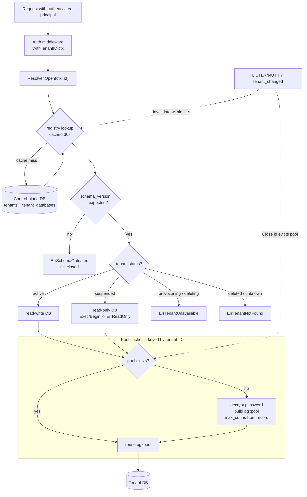

# SPEC-01: Tenancy and the resolver

**Implements:** FR-TEN-02/03/04/07/09, FR-ACC-03, NFR-SEC-01 · **Decisions:** ADR-0001, ADR-0003

## 1. Package layout
```
internal/tenant/
  resolver.go     // Resolver: tenant ID -> *DB
  db.go           // DB: the only SQL entry point for tenant data
  registry.go     // reads tenants + tenant_databases from control plane
  pool_cache.go   // lazy per-tenant pgxpool with idle eviction
  context.go      // TenantIDFromCtx / WithTenantID (identity only)
  migrate.go      // apply tenant migrations across all tenants
```

## 2. Types
```go
type ID uuid.UUID

type Status string // provisioning | active | suspended | deleting | deleted

type DB struct {            // unexported fields: constructible only here
    id       ID
    status   Status
    pool     *pgxpool.Pool
    readOnly bool
}

func (d *DB) ID() ID
func (d *DB) Query(ctx, sql, args...) (pgx.Rows, error)
func (d *DB) QueryRow(ctx, sql, args...) pgx.Row
func (d *DB) Exec(ctx, sql, args...) (pgconn.CommandTag, error)   // error if readOnly
func (d *DB) Begin(ctx) (pgx.Tx, error)                           // error if readOnly
func (d *DB) Unsafe() *pgxpool.Pool   // migration/provisioning only; lint-forbidden in app code

type Resolver interface {
    Open(ctx context.Context, id ID) (*DB, error)
    Close(id ID)            // evict pool (after delete / move)
}
```

## 3. Resolution rules
| Tenant status | `Open` result |
|---|---|
| active | read-write DB |
| suspended | read-only DB (Exec/Begin return `ErrReadOnly`) |
| provisioning, deleting | `ErrTenantUnavailable` |
| deleted / unknown | `ErrTenantNotFound` |



Registry lookups are cached for 30 s; status changes are also published via `LISTEN/NOTIFY tenant_changed` so suspension takes effect within a second.

## 4. Pool cache
- Key: tenant ID. Created on first `Open`, config from `tenant_databases` (max_conns default 5, min 0).
- Idle eviction after 10 min without a checkout; hard cap on total open pools (default 200) with LRU eviction.
- Password decrypted at pool creation using the envelope key (SPEC-09); never logged.
- Connection string change (tenant move) → `Close(id)` → next `Open` rebuilds.

## 5. Context usage
`WithTenantID(ctx, id)` is set by auth middleware and by the job worker. Used only for logs, metrics labels and tracing attributes. No data handle is ever stored in context (ADR-0003).

## 6. Provisioning (`ragctl enroll`)
1. Insert `tenants` row with status `provisioning`.
2. Create role + database on the target host (`CREATE DATABASE tenant_<id>`), generate password, encrypt, insert `tenant_databases`.
3. Run all tenant migrations; substitute `vector(N)` dimension from `tenants.settings.embedding_dim`.
4. Set status `active`; emit audit event.
Steps 2–4 run as a `provision_tenant` job so failures are retried and visible.

## 7. Migrations (`ragctl migrate tenants`)
- Migration files: `migrations/tenant/NNNN_name.sql` via goose.
- For each tenant (parallelism flag, default 4): lock row `tenant_databases ... FOR UPDATE SKIP LOCKED`, apply pending, update `schema_version`.
- Failures are recorded on the tenant row and do not stop the run; the command exits non-zero listing failed tenants. Rerun resumes only those behind.
- API and worker check `schema_version == expected` on `Open`; mismatch returns `ErrSchemaOutdated` (fail closed).

## 8. Deletion (`delete_tenant` job)
1. Status → `deleting`; resolver evicts pool; all requests refused.
2. Grace period (default 7 days) during which a platform admin can cancel.
3. `DROP DATABASE`, drop role, delete `tenant_databases` row, cascade-delete control-plane rows, status → `deleted`, audit event.

## 9. Isolation test suite
Automated tests enrol two tenants and assert that every API endpoint, with credentials for tenant A, cannot read or write anything created under tenant B, including by guessing IDs. Runs in CI on every change to `internal/tenant`, `internal/api`, `internal/worker`.
