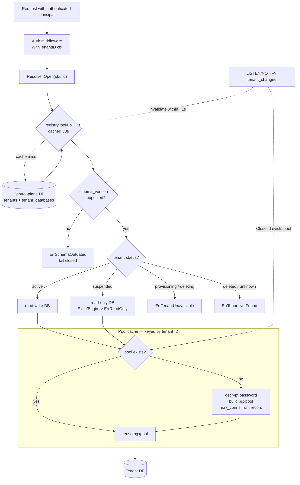

# SPEC-01: Tenancy and the resolver

**Implements:** FR-TEN-02/03/04/05/07/09, FR-ACC-03, NFR-SEC-01 · **Decisions:** ADR-0001, ADR-0003, ADR-0015, ADR-0016, ADR-0017

## 1. Package layout
```
internal/tenant/
  resolver.go     // Resolver: tenant ID -> *DB
  db.go           // DB: the only SQL entry point for tenant data
  registry.go     // reads tenants + tenant_databases from control plane
  pool_cache.go   // lazy per-tenant pgxpool with idle eviction
  context.go      // TenantIDFromCtx / WithTenantID (identity only)
internal/migrate/
  tenant.go       // apply tenant migrations across all tenants (ADR-0015)
  tenant/*.sql    // per-tenant goose migrations; 0001 = the tenant schema
```
The tenant migration runner lives in `internal/migrate` alongside the
control-plane runner (STORY-01.5): both share the goose plumbing and the
schema-drift guard. The resolver imports only `migrate.ExpectedTenantVersion()`
to fail closed on drift, so the tenant package keeps no migration logic.

## 2. Types
```go
type ID uuid.UUID

type Status string // provisioning | active | suspended | deleting | deleted

type DB struct {            // unexported fields: constructible only here
    id       ID
    status   Status
    pool     *pgxpool.Pool
    readOnly bool
}

func (d *DB) ID() ID
func (d *DB) Query(ctx, sql, args...) (pgx.Rows, error)
func (d *DB) QueryRow(ctx, sql, args...) pgx.Row
func (d *DB) Exec(ctx, sql, args...) (pgconn.CommandTag, error)   // error if readOnly
func (d *DB) Begin(ctx) (pgx.Tx, error)                           // error if readOnly
func (d *DB) Unsafe() *pgxpool.Pool   // migration/provisioning only; lint-forbidden in app code

type Resolver interface {
    Open(ctx context.Context, id ID) (*DB, error)
    Close(id ID)            // evict pool (after delete / move)
}
```

## 3. Resolution rules
| Tenant status | `Open` result |
|---|---|
| active | read-write DB |
| suspended | read-only DB (Exec/Begin return `ErrReadOnly`) |
| provisioning, deleting | `ErrTenantUnavailable` |
| deleted / unknown | `ErrTenantNotFound` |



Registry lookups are cached for 30 s; status changes are also published via `LISTEN/NOTIFY tenant_changed` so suspension takes effect within a second.

## 4. Pool cache
- Key: tenant ID. Created on first `Open`, config from `tenant_databases` (max_conns default 5, min 0).
- Idle eviction after 10 min without a checkout; hard cap on total open pools (default 200) with LRU eviction.
- Password decrypted at pool creation using the envelope key (SPEC-09); never logged.
- Connection string change (tenant move) → `Close(id)` → next `Open` rebuilds.

## 5. Context usage
`WithTenantID(ctx, id)` is set by auth middleware and by the job worker. Used only for logs, metrics labels and tracing attributes. No data handle is ever stored in context (ADR-0003).

## 6. Provisioning (`ragctl enroll`)
1. Insert `tenants` row with status `provisioning`.
2. Create role + database on the target host (`CREATE DATABASE tenant_<id>`), generate password, encrypt, insert `tenant_databases`. The privileged provisioning connection also installs the required extensions (`vector`, `pgcrypto`, `pg_trgm`) in the new database: `CREATE EXTENSION` is superuser-only, so it cannot live in a tenant migration, which runs as the least-privilege per-tenant role (SPEC-09). Migrations assume the extensions exist.
3. Run all tenant migrations; substitute the `vector(N)` dimension placeholder from `tenants.settings.embedding_dim`.
4. Set status `active`; emit audit event.
Steps 2–4 run as a `provision_tenant` job so failures are retried and visible.

## 7. Migrations (`ragctl migrate tenants`)
- Migration files: `internal/migrate/tenant/NNNN_name.sql` via goose, embedded in the binary (ADR-0015). `0001_initial_schema.sql` is the tenant schema; the human-readable `schemas/tenant.sql` is its documented shape and a drift test proves they never disagree. Version bookkeeping is goose's `goose_db_version` table inside each tenant DB.
- The embedding vector dimension in migration 0001 is a placeholder the runner substitutes per tenant from `tenants.settings.embedding_dim` (default 1536) before applying, so one migration set serves tenants on different embedding models. The runner rejects a non-positive dimension (fail closed).
- For each tenant (parallelism flag, default 4, one goose `Provider` per tenant so the parallel fan-out shares no global state): in one control-plane transaction, lock the `tenant_databases` row `FOR UPDATE SKIP LOCKED`, apply pending migrations against the tenant DB with its per-tenant role, then mirror the resulting goose version into `schema_version`. `SKIP LOCKED` means a concurrent runner (or a run already working that tenant) is skipped cleanly, not failed.
- Failures are recorded per tenant and do not stop the run; the command exits non-zero listing failed tenants (by slug). Rerun resumes only those behind, because a successful tenant is already at the target version and re-locking a row held by another runner is skipped. Only `provisioning`/`active`/`suspended` tenants with a `tenant_databases` row are eligible; `deleting`/`deleted` are ignored.
- The expected version the resolver enforces is derived from the embedded migrations (`migrate.ExpectedTenantVersion()`), not a hand-kept constant, so it always tracks what the runner applies.
- API and worker check `schema_version == expected` on `Open`; mismatch returns `ErrSchemaOutdated` (fail closed).

## 8. Suspension and deletion (ADR-0017)

The `Lifecycle` service (`internal/provision`) owns the post-provisioning status
machine and the teardown. Every status write goes through the control plane, so
the `tenant_changed` trigger (§3) fires and the resolver reflects the change
within ~1s. Each operation writes a control-plane audit event (C-3): non-secret
metadata only. The transitions it allows are: `active↔suspended`,
`active/suspended→deleting`, `deleting→(active|suspended)` (cancellation),
`deleting→deleted` (final); anything else is rejected (fail closed).
Provisioning→active belongs to the provisioner (§6), not this service.

**Suspension (FR-TEN-04).** `Suspend` moves `active→suspended`; the resolver then
hands back a read-only `DB` (end-user query/ingest writes refused with
`ErrReadOnly`), while an admin/superuser can still read the tenant database.
`Resume` moves `suspended→active`.

**Deletion (FR-TEN-05).**
1. `ScheduleDelete`: status → `deleting`; record `tenants.delete_after = now() +
   grace` (default 7 days) and stash the prior status in
   `settings.delete_prev_status`. The resolver evicts the pool and refuses all
   requests (`ErrTenantUnavailable`). Data is retained during the grace window.
2. `CancelDelete` (allowed any time before the drop): clear `delete_after`,
   restore the stashed prior status (`active`/`suspended`), so the tenant serves
   again; nothing is dropped.
3. `RunDelete` (only once `now ≥ delete_after`; refused before): `DROP DATABASE …
   WITH (FORCE)` then `DROP ROLE` (that order, so the role owns nothing when
   dropped), remove the object-storage prefix, then in one control-plane
   transaction delete the tenant's child rows (`tenant_databases`,
   `tenant_members`, `api_keys`, `sources`, `jobs`, `usage_daily`) and set the
   `tenants` row to `deleted` with `deleted_at`. The `tenants` row is kept as a
   tombstone so the audit history survives; every other row for the tenant is
   gone. All drops are `IF EXISTS`, so a re-run after a partial teardown
   completes cleanly.

The `delete_after` column (control migration `00003`) is the authoritative grace
deadline and gates `RunDelete` independently of any queue. Object-storage prefix
removal is deferred until a client exists (EPIC-06); until then the teardown
records `object_store_deferred` on its result and audit event rather than
silently skipping it (ADR-0017).

Async scheduling via a River `delete_tenant` job (ADR-0005, already in the
`job_kind` enum, SPEC-08 §1) is deferred to EPIC-09; until then `ragctl tenant
delete` invokes the same idempotent handler synchronously (`--` schedule /
`--cancel` / `--run`), honouring the grace deadline in-handler, exactly as
`ragctl enroll` does for provisioning (ADR-0016).

**Move (FR-TEN-07).** `Move` updates a tenant's stored connection record in
`tenant_databases` — any subset of host/port/database/username/ssl_mode, and
optionally a rotated password — leaving the tenant's status unchanged. Only the
supplied fields change (`COALESCE`); an all-empty request is rejected (a move
that changes nothing is a caller error, not a silent no-op). A supplied password
is envelope-encrypted with the platform `Cipher` before the write, symmetric with
the resolver's decrypt (SPEC-09 §2), and is never logged; the audit event records
the changed connection metadata and a `password_rotated` flag only (C-3). The
whole update runs in one control-plane transaction that locks the tenant row, so
it serialises against concurrent lifecycle operations on the same tenant.

Because the write goes through the control plane, the `tenant_changed` trigger
(§3) fires and the resolver evicts the tenant's pool and invalidates its cached
record within ~1s; the next `Open` rebuilds against the new connection (§4).
`Resolver.Close(id)` is the same eviction path, used directly when a caller wants
immediate rebuild without waiting for the notification. A move only repoints the
registry — it does not copy the tenant's data; the operator restores the tenant
database to the new host out of band first (see `docs/runbooks/move-tenant.md`).

The `PATCH /admin/tenants/{id}` HTTP route in the AC (FR-TEN-07) is deferred to
EPIC-04 (STORY-04.6): the public router does not exist until STORY-04.1. Until
then `ragctl tenant move --slug <slug> [--db-host …] [--db-name …] [--db-user …]
[--db-port …] [--db-ssl-mode …] [--db-password …]` is the sole entry point,
invoking the same `Lifecycle.Move` handler synchronously — exactly as
enroll/suspend/delete defer their HTTP routes (ADR-0016/0017).

## 9. Isolation test suite
Automated tests enrol two tenants and assert that every API endpoint, with credentials for tenant A, cannot read or write anything created under tenant B, including by guessing IDs. Runs in CI on every change to `internal/tenant`, `internal/api`, `internal/worker`.
