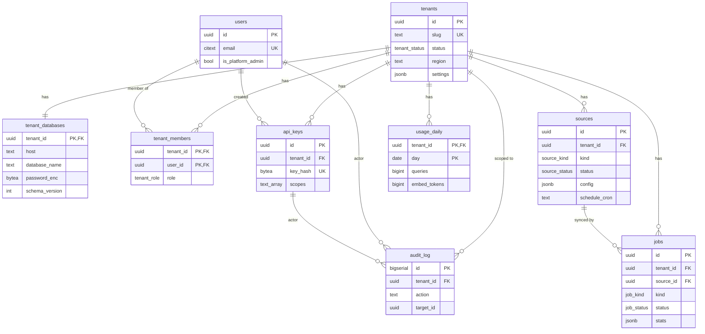

# SPEC-02: Control plane

**Implements:** FR-TEN-01/05/06/08, FR-ACC-01..07, FR-ADM-05/06/07 · **Decisions:** ADR-0001, ADR-0005 · **Schema:** schemas/control_plane.sql

## 1. Responsibilities
Tenant registry and lifecycle, users and membership, API keys, source definitions, job history, usage counters, audit log. Never holds tenant content.



## 2. Services (Go packages)
| Package | Owns tables | Notes |
|---|---|---|
| `internal/cp/tenants` | tenants, tenant_databases | provisioning/deletion orchestration via jobs |
| `internal/cp/auth` | users, tenant_members, api_keys | password hashing (argon2id), OIDC, key hashing (sha256) |
| `internal/cp/sources` | sources | config validation delegated to connector kind |
| `internal/cp/jobs` | jobs (+ River tables) | enqueue, mirror status, cancel |
| `internal/cp/usage` | usage_daily | upsert counters; aggregated by API and worker |
| `internal/cp/audit` | audit_log | append-only |

## 3. Authentication
- Session auth for the admin UI: cookie with server-side session (Postgres table or Redis), CSRF token.
- API key auth: `Authorization: Bearer rk_<prefix>_<secret>`. Lookup by prefix, constant-time compare of sha256. Key row yields tenant ID and scopes.
- OIDC: standard code flow; `users.external_id` = issuer subject. JIT user creation configurable.

## 4. Authorisation
Role matrix (tenant scope):

| Action | owner | admin | editor | viewer |
|---|---|---|---|---|
| query / retrieve | ✓ | ✓ | ✓ | ✓ |
| upload documents | ✓ | ✓ | ✓ | |
| manage sources, trigger sync | ✓ | ✓ | | |
| manage members, API keys | ✓ | ✓ | | |
| change tenant settings | ✓ | ✓ | | |
| delete tenant (request) | ✓ | | | |

Platform admin (`users.is_platform_admin`) may act on any tenant; every such action is audited with `details.impersonation=true`.

## 5. Tenant settings (`tenants.settings` JSON)
```json
{
  "embedding": {"provider":"voyage","model":"voyage-3","dim":1024},
  "llm": {"provider":"anthropic","model":"claude-sonnet-4-6","max_tokens":1024},
  "reranker": {"enabled":false,"provider":"cohere","model":"rerank-v3.5","top_n":20},
  "chunking": {"target_tokens":512,"overlap_tokens":64},
  "retrieval": {"k_vector":40,"k_text":40,"final_k":8,"min_score":0.02},
  "limits": {"qps":10,"max_upload_mb":50,"max_pages_per_crawl":5000},
  "providers_allowed": ["anthropic","voyage","cohere"]
}
```
Validated against a JSON schema on write. `embedding.dim` is immutable after provisioning except through the reindex job.

## 6. Audit events (minimum set)
tenant.create/suspend/resume/delete-request/delete-cancel/delete-done, member.add/remove/role-change, apikey.create/revoke, source.create/update/delete/sync-trigger, settings.update, job.cancel, admin.impersonate.

## 7. CLI (`ragctl`)
```
ragctl enroll --slug acme --name "Acme Inc" --region eu-central --db-host pg-1
ragctl tenants list|suspend|resume|delete|export <slug>
ragctl migrate control     # control-plane migrations
ragctl migrate tenants [--parallel 4] [--tenant slug]
ragctl sync <slug> <source-name>
ragctl reindex <slug> --embedding-model ...
ragctl keys rotate-dek     # re-encrypt all secrets with new data-encryption key
```
