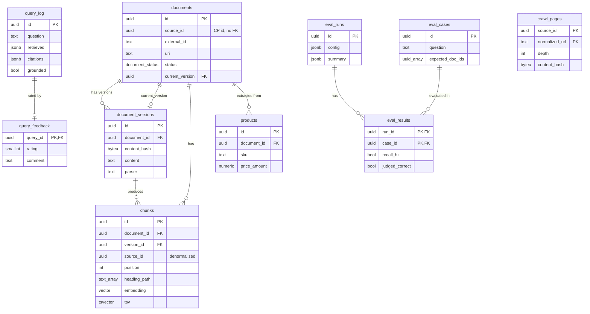

# SPEC-03: Tenant data model

**Implements:** FR-ING-01/02/04/06/07, FR-RET-09/10, FR-ADM-04 · **Decisions:** ADR-0004, ADR-0008 · **Schema:** schemas/tenant.sql

## 1. Entities
- **documents** — identity `(source_id, external_id)`; `current_version` pointer; soft delete via `status`.
- **document_versions** — immutable normalised content, `content_hash`, parser id, optional raw payload.
- **chunks** — belong to a version; `embedding vector(N)`, generated `tsv`; `heading_path` for citations and context.
- **live_chunks** view — retrieval reads only this.
- **crawl_pages** — per-source crawl frontier state.
- **products** — optional structured extraction.
- **query_log / query_feedback** — observability and eval data.
- **eval_cases / eval_runs / eval_results** — evaluation harness.
- **schema_migrations** — records applied tenant-schema versions inside the tenant DB (`version`, `applied_at`); the authoritative per-tenant version is mirrored to control-plane `tenant_databases.schema_version` (SPEC-01 §7).

> Note: `live_chunks` (a view over active documents' current-version chunks) and `schema_migrations` are omitted from the ER diagram. `source_id`, `api_key_id` and `user_id` are informational copies of control-plane IDs — no cross-database foreign keys exist (see Invariant 4).

## 2. Invariants
1. A document with `status='active'` always has a non-null `current_version`.
2. Chunks are never updated in place; a new version gets new chunks.
3. `chunks.embedding_model` equals the tenant's configured model for all live chunks, except during a reindex.
4. No cross-database foreign keys: `source_id`, `api_key_id`, `user_id` are informational copies of control-plane IDs.

## 3. Sizing guidance
- 512-token chunks ≈ 2 KB text + 4 KB embedding (1024-d float32) ≈ 6–8 KB/row with indexes.
- 1 M chunks ≈ 8 GB. HNSW build for 1 M rows ~ 10–20 min; `maintenance_work_mem` ≥ 2 GB recommended during reindex.

## 4. Retention and GC (SPEC-08 `gc_tenant` job, daily)
- Non-current document_versions older than 30 days → delete (cascades chunks).
- `status='deleted'` documents older than 30 days → delete.
- query_log older than 90 days → delete (feedback cascades).
- crawl_pages not seen in 3 successful syncs → delete.

## 5. Embedding dimension change (reindex)
1. Create `chunks_new` with the new `vector(N2)` and indexes, no data.
2. Reindex job embeds every live version into `chunks_new`.
3. In one transaction: rename `chunks`→`chunks_old`, `chunks_new`→`chunks`, recreate `live_chunks`; update tenant setting.
4. Drop `chunks_old` after verification. Queries keep working on the old table throughout.

Realised (STORY-05.8, ADR-0039): steps 1–4 are `documents.TenantStore.{CreateChunksNew, SwapChunks, DropChunksOld}` (+ `VerifyCoverage`) reached only through `*tenant.DB`. The swap (step 3) is one Postgres DDL transaction (drop `live_chunks`, rename, recreate `live_chunks`) so no query sees a half-swapped state. "Update tenant setting" is the control-plane `settings.embedding_dim` mirror (ADR-0022), moved by the driving worker (STORY-09.1) as the finalize step — it is not a tenant-DB object, so it is out of the swap transaction's reach (C-3); the physical `vector(N2)` column moves inside the swap. "After verification" (step 4) is a coverage re-check against the now-live table: every live version must be represented before `chunks_old` is dropped.
