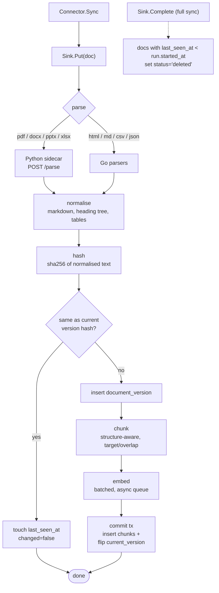

# SPEC-05: Ingestion pipeline

**Implements:** FR-ING-01..11 · **Decisions:** ADR-0006, ADR-0008

## 1. Flow per document
```
Connector.Sync ─► Sink.Put(doc)
                    │
                    ├─ parse        (Go parsers or Python sidecar) ─► Normalised{Title, Blocks}
                    ├─ normalise    (markdown text, heading tree, tables as markdown)
                    ├─ hash         (sha256 of normalised text)
                    ├─ compare      (== current version hash? touch last_seen_at, return changed=false)
                    ├─ insert version
                    ├─ chunk        (structure-aware, target/overlap from settings)
                    ├─ embed        (batched, async via embedding queue)
                    └─ commit       (insert chunks; flip current_version in one tx)
```


`Sink.Complete` (full sync only): documents of the source with `last_seen_at < run.started_at` → `status='deleted'`.

## 2. Parsers
| MIME | Parser |
|---|---|
| text/html | Go: readability + html-to-markdown |
| text/markdown, text/plain | Go passthrough, heading detection |
| text/csv, application/json | Go: row/record → markdown table or key-value text |
| application/pdf, docx, pptx, xlsx | Python sidecar `POST /parse` |
Sidecar response: `{title, blocks:[{type:"heading|paragraph|table|list|code", level, text, rows}]}`. Sidecar timeout 120 s; failures mark the document with `metadata.parse_error` and do not fail the whole sync.

## 3. Chunking
- Walk blocks maintaining `heading_path`.
- Accumulate paragraphs until `target_tokens` (default 512); never split a table row or code block unless it alone exceeds 2× target.
- Overlap: carry the last `overlap_tokens` (64) of the previous chunk.
- Prepend a context line to the embedded text (not stored content): `"{title} > {heading_path joined}"` — improves retrieval of short chunks.
- Token counting via tiktoken `cl100k_base` (approximation is acceptable across providers).

## 4. Embedding
- Interface `Embedder.Embed(ctx, []string) (Result, error)` where `Result{Vectors [][]float32, Tokens int}`; providers: OpenAI, Voyage, Cohere, TEI (self-hosted). The Go interface returns a `Result` rather than a bare `[][]float32` so the per-call token usage this section requires be recorded is surfaced alongside the vectors instead of lost — `Result.Vectors` is that `[][]float32`, aligned one-to-one with the input, and `Result.Tokens` is the provider-reported usage (0 when the provider's API omits it, e.g. TEI). Adding a provider is one `Embedder` implementation (NFR-MNT-02). See ADR-0037.
- Batches of ≤ 96 texts / ≤ 100k tokens; bounded concurrency per tenant (default 4 batches in flight). The value returned by `embed.New` is itself an `Embedder` that partitions an arbitrary input into provider-sized batches, runs them with the bounded concurrency, and reassembles vectors in input order.
- Retries with exponential backoff on 429/5xx; honours `Retry-After`; circuit breaker per provider (opens after N consecutive failures, short-circuits with `ErrCircuitOpen` for a cooldown, then admits one half-open trial).
- Provider access is fail-closed against the tenant's `settings.providers_allowed` (SPEC-09 §2): `embed.New` refuses a provider absent from the allowlist (`ErrProviderNotAllowed`).
- Token usage recorded into `jobs.stats` and `usage_daily`: the embedder surfaces `Result.Tokens`; the sink (STORY-05.6) folds it into `usage.Delta.EmbedTokens` and `jobs.stats.embed_tokens`.

## 5. Commit semantics
Per document, one transaction: insert `document_versions`, insert all `chunks`, `UPDATE documents SET current_version=$1, last_seen_at=now(), status='active'`. If embedding fails the transaction is not opened; the document keeps its previous version and the job records the error.

Realised by the ingestion **sink** (`internal/ingest/sink`, STORY-05.6, ADR-0038), which composes the §1 stages and owns no SQL of its own: the §1 "compare (== current version hash?)" step is the atomic `documents.TouchIfUnchanged` store method (touch `last_seen_at` and skip chunk/embed on a match — so an unchanged document costs no embedding), the per-document transaction is `documents.Put` (ADR-0008/0033), and `Sink.Complete` soft-deletes unseen documents on a **full sync only** via `documents.SoftDeleteUnseen` (`last_seen_at < run.started_at`), where `started_at` is captured when the run begins. A single-document parse or embed error is recorded in `jobs.stats.errors` and the sync continues (§2/§8); `embed.ErrCircuitOpen` returns a `sink.SnoozeError` so the worker snoozes the job rather than failing it (§8). A worker crash mid-sync leaves no partial document: completed documents are whole and unseen ones are skipped by hash on the retry.

## 6. Job stats (`jobs.stats`)
`docs_seen, docs_changed, docs_unchanged, docs_deleted, docs_failed, chunks_written, embed_tokens, bytes_fetched, duration_ms, errors:[{external_id, msg}] (capped at 100)`.

## 7. Reindex job
Iterates live versions in `document_id` order, re-chunks if chunking settings changed, embeds with the new model into `chunks_new`, then performs the swap from SPEC-03 §5. Resumable via a cursor stored in job payload.

## 8. Failure modes and handling
| Failure | Handling |
|---|---|
| Source unreachable | job fails, retry with backoff (3 attempts), source.status=error after final failure |
| Single document parse error | recorded, skipped, job succeeds with `docs_failed>0` |
| Provider quota exhausted | job paused (snoozed) for `Retry-After`, not failed |
| Worker crash mid-sync | per-document transactions mean no partial documents; job retried; unchanged docs are skipped by hash |
