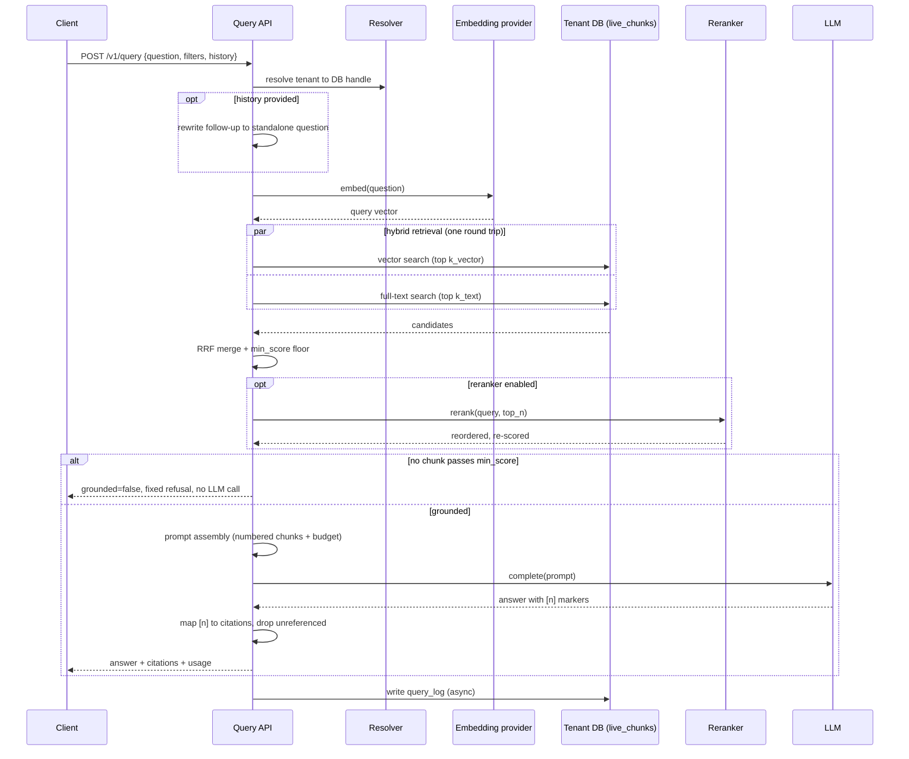

# SPEC-06: Retrieval and answering

**Implements:** FR-RET-01..10, NFR-PERF-01/02, NFR-REL-04 · **Decisions:** ADR-0004, ADR-0007

## 1. Pipeline
```
question ─► embed(question) ─┬─► vector search  top k_vector ─┐
                             └─► full-text search top k_text ─┤─► RRF merge ─► filter floor ─► [rerank top_n] ─► top final_k
                                                                                                                │
           conversation history ─► question rewrite (optional) ──────────────────────────────────────────────────┘
                                                                                                                ▼
                                                                    prompt assembly ─► LLM ─► answer + citations ─► query_log
```



## 2. Hybrid SQL (single round trip)
```sql
with v as (
  select id, row_number() over (order by embedding <=> $1) as r
  from live_chunks where ($2::uuid[] is null or source_id = any($2))
  order by embedding <=> $1 limit $3
), t as (
  select id, row_number() over (order by ts_rank_cd(tsv, q) desc) as r
  from live_chunks, websearch_to_tsquery('simple', $4) q
  where tsv @@ q and ($2::uuid[] is null or source_id = any($2))
  order by ts_rank_cd(tsv, q) desc limit $5
), f as (
  select id, sum(1.0/(60+r)) as score from (select * from v union all select * from t) u group by id
)
select c.*, f.score from f join live_chunks c on c.id = f.id order by f.score desc limit $6;
```
Filters beyond source (date range, URL prefix, metadata tags) are added to both CTEs. `hnsw.ef_search` set per query to `max(40, k_vector)`.

## 3. Reranking
If `settings.reranker.enabled`, top `top_n` fused results go to `Reranker.Rerank(query, texts)`; final order by reranker score; `min_score` then applies to reranker score instead of fused score.

## 4. Grounding and refusal
If no chunk passes `min_score`, respond with `grounded=false`, a fixed message ("I couldn't find information about that in <tenant name>'s content."), zero citations, and still log the query. No LLM call is made.

## 5. Prompt assembly
- System: tenant name, instructions to answer only from provided sources, cite as `[n]`, say when unsure, match the user's language.
- Context: numbered chunks with `title > heading_path` header and `uri`, truncated to a token budget (default 6k).
- History: last N turns (default 6) if provided; optional rewrite step turns a follow-up into a standalone question before retrieval.
- Answer post-processing: map `[n]` markers to chunk IDs → citations `[{n, document_id, title, uri, heading_path, snippet}]`; unreferenced chunks are dropped from citations.

## 6. API contracts (see SPEC-07 for transport)
`POST /v1/query` request:
```json
{"question":"How do I reset the X200?","filters":{"source_ids":[],"uri_prefix":"https://docs.acme.com/"},
 "history":[{"role":"user","content":"..."},{"role":"assistant","content":"..."}],
 "stream":false,"top_k":8}
```
Response:
```json
{"id":"q_...","answer":"...","grounded":true,
 "citations":[{"n":1,"document_id":"...","title":"X200 manual","uri":"https://...","heading_path":["Reset"],"snippet":"..."}],
 "usage":{"retrieval_ms":120,"generation_ms":1400,"in_tokens":3200,"out_tokens":180},
 "model":"claude-sonnet-4-6"}
```
Streaming: SSE events `retrieval` (citations first), `delta` (text), `done` (usage).

## 7. Performance budget (p95, 1 M chunks)
embed question 80 ms · hybrid SQL 120 ms · rerank (optional) 250 ms · prompt build 5 ms · log write async. Total pre-generation ≤ 300 ms without rerank, ≤ 550 ms with.

## 8. Evaluation harness
`ragctl eval run <slug> [--config file]` runs all `eval_cases`, records `eval_results`, prints recall@k (expected_doc_ids ∩ retrieved), grounded rate, LLM-judged correctness (optional), mean latency. Used as a gate before changing chunking/retrieval settings for a tenant.
