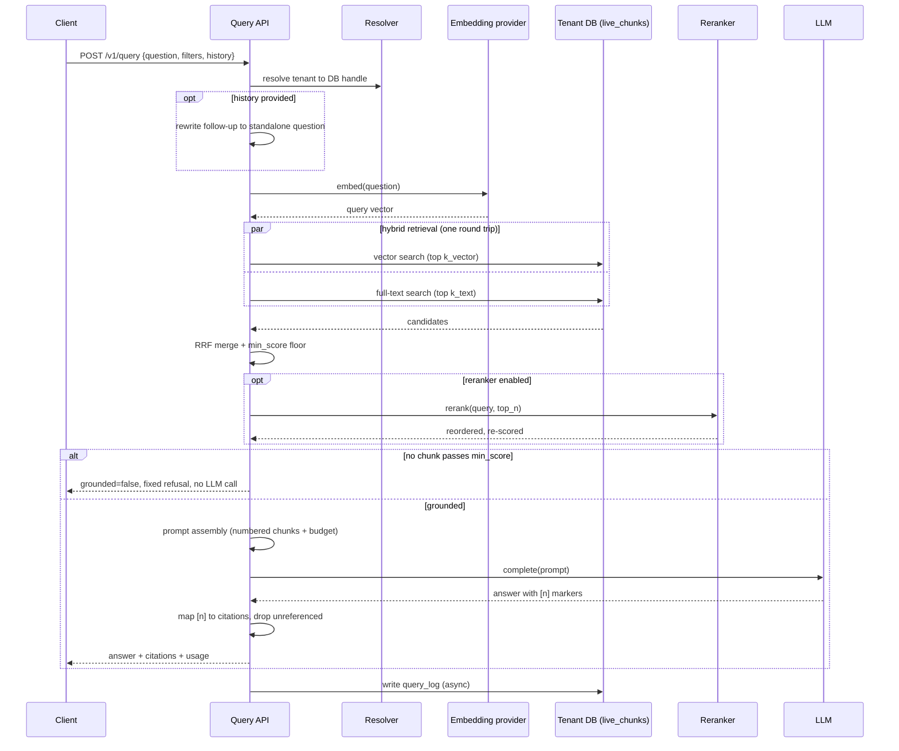

# SPEC-06: Retrieval and answering

**Implements:** FR-RET-01..10, NFR-PERF-01/02, NFR-REL-04 · **Decisions:** ADR-0004, ADR-0007, ADR-0051, ADR-0052, ADR-0053, ADR-0054, ADR-0055, ADR-0056, ADR-0057

## 1. Pipeline
```
question ─► embed(question) ─┬─► vector search  top k_vector ─┐
                             └─► full-text search top k_text ─┤─► RRF merge ─► filter floor ─► [rerank top_n] ─► top final_k
                                                                                                                │
           conversation history ─► question rewrite (optional) ──────────────────────────────────────────────────┘
                                                                                                                ▼
                                                                    prompt assembly ─► LLM ─► answer + citations ─► query_log
```



## 2. Hybrid SQL (single round trip)
The vector and full-text CTEs rank the `chunks` table directly, expressing liveness
as a semi-join on `version_id` (`version_id in (select current_version from documents
where status='active' …)`) rather than reading the `live_chunks` view. `version_id`
is globally unique, so this is **semantically identical** to `live_chunks` (only the
current version of an active document, SPEC-03 §2 Invariants 1–2) — but ranking over
the *view* forces the planner to resolve its `documents` join before the
`order by embedding <=> $1 limit $3`, which defeats the hnsw index and falls back to a
full Sort (≈180 ms at 50 k, seconds at 1 M — see §7). Filtering `chunks` directly lets
pgvector's iterative index scan drive the hnsw index and post-filter (ADR-0051). The
optional uri-prefix and metadata-tag document filters fold into the liveness subquery;
source and date range are chunk-column guards. Each filter is a `$n is null or …`
no-op when unset. `$1` embedding, `$2` source uuid[], `$3` k_vector, `$4` query text,
`$5` k_text, `$6` final k, `$7` uri LIKE pattern (escaped), `$8`/`$9` created_at
range, `$10` metadata jsonb.

The liveness + document-filter semi-join (below as `live(...)`) is inlined
identically in both CTEs rather than a shared CTE — a CTE referenced twice can be
materialised, which would change the plan away from the index scan.

```sql
-- live(...) := c.version_id in (
--   select d.current_version from documents d
--   where d.status = 'active'
--     and ($7::text  is null or d.uri like $7 escape '\')
--     and ($10::jsonb is null or d.metadata @> $10))
with v as (
  select c.id, row_number() over (order by c.embedding <=> $1::vector) as r
  from chunks c
  where live(...)
    and ($2::uuid[] is null or c.source_id = any($2))
    and ($8::timestamptz is null or c.created_at >= $8)
    and ($9::timestamptz is null or c.created_at <= $9)
  order by c.embedding <=> $1::vector limit $3
), t as (
  select c.id, row_number() over (order by ts_rank_cd(c.tsv, q) desc) as r
  from chunks c, websearch_to_tsquery('simple', $4) q
  where c.tsv @@ q and live(...)
    and ($2::uuid[] is null or c.source_id = any($2))
    and ($8::timestamptz is null or c.created_at >= $8)
    and ($9::timestamptz is null or c.created_at <= $9)
  order by ts_rank_cd(c.tsv, q) desc limit $5
), f as (
  select id, sum(1.0/(60+r)) as score from (select * from v union all select * from t) u group by id
)
select c.*, d.uri, d.title, f.score
from f join chunks c on c.id = f.id join documents d on d.id = c.document_id
order by f.score desc limit $6;
```
Per query, inside a read-only transaction, set (transaction-local, via
`set_config(…, true)` so they never leak to the pooled connection):
`hnsw.ef_search = max(40, k_vector)`; `hnsw.iterative_scan = strict_order` (candidates
in exact distance order so the fusion ranks are the true nearest-neighbour ranks); and
`plan_cache_mode = force_custom_plan`. The last is essential: the `$n is null or …`
filter guards defeat a *generic* prepared-statement plan (which pgx's statement cache
adopts after a few executions), which cannot prune the guards and abandons the hnsw
index — measured ~180 ms vs ~15 ms for the custom plan at 100 k chunks (ADR-0051). A
one-off EXPLAIN is always custom-planned, so it will not reveal this; the benchmark
measures real per-call latency.
**Requires pgvector ≥ 0.8** (iterative scan); on an older extension the query falls
back to full-sort latency, so the platform pins ≥ 0.8 and the `SET` fails loudly if it
is absent. The implementation (`internal/retrieve`) reaches the tenant DB only through
a `*tenant.DB` handle (ADR-0003); the query embedding ($1) is produced by the caller
(the query API, STORY-08.2), keeping retrieval embedding-provider agnostic.

STORY-08.2 realises the caller for the retrieval-only endpoint `POST /v1/retrieve`
(FR-RET-08, SPEC-07 §2e): `internal/retrieve.Service` embeds the incoming query
string with the tenant's configured embedding provider (the same
`internal/ingest/embed` seam the corpus used, so query and documents share an
embedding space; fail-closed on `providers_allowed`), then runs the hybrid query
above and returns the ranked chunks — no generation, no `min_score` floor. `top_k`
defaults to `settings.retrieval.final_k` and is clamped to a fixed ceiling. See
ADR-0052.

## 3. Reranking
If `settings.reranker.enabled`, top `top_n` fused results go to `Reranker.Rerank(query, texts)`; final order by reranker score; `min_score` then applies to reranker score instead of fused score.

### 3.1 Reranker seam (STORY-08.3, ADR-0054)
`internal/rerank` is the provider-neutral reranker seam (FR-RET-03). One interface,
two providers, one factory (NFR-MNT-02):

```
Reranker.Rerank(ctx, query string, docs []Doc) ([]Scored, error)
Doc{ID, Text}   Scored{ID, Score}   // Doc.ID/Scored.ID are chunk ids
New(Config) (Reranker, error)        // (nil, nil) when settings.reranker.enabled=false
```

- **Cohere reranker** — real HTTP `POST {base}/v2/rerank` with `{model, query,
  documents}` (Cohere v2 rerank API; model `rerank-v3.5`), Bearer `COHERE_API_KEY`.
  `top_n` is NOT sent, so every candidate comes back scored and the service reorders
  the full set. Wrapped with the same bounded-backoff retry (429/5xx, `Retry-After`)
  + circuit breaker the embedding/LLM seams use (ADR-0037/0053). Fail-closed on the
  provider allowlist (`settings.providers_allowed`, SPEC-09 §2) and on a missing key.
- **LLM reranker** — scores **all** candidates in **ONE** batched `llm.Complete`
  call (a listwise prompt numbering the top_n passages + the query, returning a
  JSON `[{id,score}]` ranking — never per-document calls). It reuses the tenant's
  `settings.llm` provider/model via the `internal/llm` factory (§5.1), so the
  provider + model allowlists are enforced there. An optional
  `settings.reranker.llm_model` overrides the model just for reranking (e.g. a
  cheaper model); absent, it reuses `settings.llm.model`. The JSON is parsed
  defensively (code-fence/prose tolerant); unparseable output is a provider failure.
- **Toggle** — `settings.reranker.enabled` (default false) gates it per tenant;
  `settings.reranker.provider` selects `cohere`|`llm`; `top_n` is how many fused
  results to rerank (default 20).
- **Fallback (FR-RET-03 AC, NFR-REL-04)** — a reranker never fails the query. Any
  error — network, breaker-open, missing key, unparseable LLM output, fail-closed
  allowlist — is logged and the query returns the original fused order.

### 3.2 Service wiring
`internal/retrieve.Service.Search` applies reranking on the fused set: when enabled
it over-fetches `max(top_n, final_k)` fused candidates (the hybrid query's `limit`),
reranks the top `top_n`, reorders by reranker score, then truncates to `final_k`.
The `/v1/retrieve` response `score` is the fused RRF score normally, or the reranker
relevance score when reranking is enabled. The `min_score` grounding floor / refusal
(§4) is **not** applied here — that is STORY-08.5; 08.3 leaves a clean seam.

## 4. Grounding and refusal
If no chunk passes `min_score`, respond with `grounded=false`, a fixed message ("I couldn't find information about that in <tenant name>'s content."), zero citations, and still log the query. No LLM call is made.

## 5. Prompt assembly
- System: tenant name, instructions to answer only from provided sources, cite as `[n]`, say when unsure, match the user's language.
- Context: numbered chunks with `title > heading_path` header and `uri`, truncated to a token budget (default 6k).
- History: last N turns (default 6) if provided; optional rewrite step turns a follow-up into a standalone question before retrieval.
- Answer post-processing: map `[n]` markers to chunk IDs → citations `[{n, document_id, title, uri, heading_path, snippet}]`; unreferenced chunks are dropped from citations.

### 5.2 Answering service (STORY-08.5, ADR-0055)
`internal/answer` realises §4–5 as `Service.Answer(ctx, Request) (Result, error)`,
the seam STORY-08.6 wraps with the `/v1/query` endpoint + SSE. It consumes the
ranked chunks from `internal/retrieve` (their `Score` already the reranker score
when reranking is enabled, else the fused RRF score — §3), the question, provided
history (verbatim; the follow-up rewrite is STORY-08.7), and the tenant's resolved
settings (the display name from the control-plane `tenants.name` row; the rest from
`settings.{retrieval.min_score, answering, llm}`).

- **Grounding gate (§4):** `Answer` keeps only chunks with `Score ≥ min_score`; if
  none pass it returns the fixed refusal without building the provider — no LLM call
  is made. The refusal, and the grounded answer, both go through a `QueryLogger`
  seam so STORY-08.8 can persist either path (nil = no-op here).
- **Token budget (§5):** the numbered context is trimmed to
  `settings.answering.token_budget` (default 6000). The token count is a
  `len/4` estimate (ponytail — upgrade to a real `count_tokens`); the top chunk is
  always included (content truncated if it alone overflows) so a grounded query is
  never assembled with an empty context. `settings.answering.history_n` (default 6)
  bounds the included history turns.
- **Generation + usage (FR-RET-04):** generation goes through the `internal/llm`
  `Complete` seam (§5.1); the provider's normalised `Usage` is folded into
  `usage_daily` (`usage.Delta.LLMInTokens/LLMOutTokens`, ADR-0024) and into the
  response `usage{retrieval_ms, generation_ms, in_tokens, out_tokens}`. A provider
  failure (incl. `llm.ErrCircuitOpen`) is surfaced as a clean wrapped error — the
  graceful degradation to retrieval-only is STORY-08.6's concern.

The `settings.answering` object (`token_budget`, `history_n`) is added to the
settings schema/defaults in this story; `min_score` already lives under
`settings.retrieval`.

### 5.3 Conversation history and question rewrite (STORY-08.7, ADR-0057)
`internal/query` inserts an optional follow-up→standalone question **rewrite** step
BEFORE retrieval (FR-RET-07), realising the §1 pipeline's `question rewrite (optional)`
branch and §5's "optional rewrite step turns a follow-up into a standalone question
before retrieval":

- **Toggle (per tenant, default OFF):** `settings.rewrite.enabled` gates it, matching
  the conservative opt-in of `settings.reranker.enabled`. `settings.rewrite.model`
  optionally overrides the model for the rewrite call only (a cheap model), still gated
  by `settings.llm.models_allowed` fail-closed inside the shared `internal/llm` factory
  (§5.1) — a rejected override falls back to the original question.
- **When it runs:** only when the toggle is on AND the request carries `history[]`.
  With the toggle off, or a single-turn query (no history), the original question is
  used unchanged and **no rewrite LLM call is made** — a strict passthrough, so a
  single-turn query is byte-identical to the pre-08.7 pipeline (the AC's "no regression
  on single-turn"; a full eval harness is EPIC-12/§8).
- **The call:** one `Provider.Complete` (last N turns, `settings.answering.history_n`,
  default 6) with a fixed system prompt that resolves pronouns/ellipsis into a
  self-contained question; the conversation is delimited **data**, never instructions
  (prompt-injection defence, SPEC-09 §2). The result is parsed defensively (unwrap code
  fences/quotes); on empty or garbled output, or any provider error (incl.
  `ErrCircuitOpen`), it falls back to the **original** question — the rewrite never
  fails the query (NFR-REL-04).
- **What uses what:** RETRIEVAL (embedding + full-text) runs on the **standalone**
  question; the ANSWER stage (§5, STORY-08.5) still receives the **original** question
  plus history verbatim, so the model answers the user's actual turn in context.

### 5.4 Query log and feedback (STORY-08.8, ADR-0058)
The `QueryLogger` seam left on `Answer`/`RecordStreamed` (§5.2) is filled by
`internal/querylog.Logger`, which persists every answered query — grounded and
refusal — to the tenant's `query_log` (FR-RET-09) **asynchronously** on a background
goroutine so logging never blocks or fails the response (a failure is logged without
content, C-4, and swallowed). `POST /v1/feedback` (`query` scope) writes
`query_feedback` (FR-RET-10) and `GET /v1/queries` (`admin` scope) lists the log
with joined feedback. `query_log`/`query_feedback` are tenant content reached only
through the resolver + `*tenant.DB` (ADR-0003, C-1, C-3). Transport, request/response
shapes and the async lifecycle are SPEC-07 §2g.

## 5.1 LLM provider seam (STORY-08.4, ADR-0053)
Generation goes through `internal/llm`, a provider-neutral seam consumed by the
LLM-based reranker (§3, STORY-08.3), prompt assembly (§5, STORY-08.5) and the query
endpoint's SSE (§6, STORY-08.6):

```
Provider.Complete(ctx, Request) (Response, error)   // non-streaming
Provider.Stream(ctx, Request)   (Stream, error)     // streaming (pull iterator: Recv → Event, io.EOF)
Request{Model, System, Messages[], MaxTokens, Temperature?, TopP?, Effort?}
Response{Text, Usage{InputTokens, OutputTokens}, FinishReason, Model}
```

- **Providers** (one interface each, NFR-MNT-02): `anthropic` via the official
  `anthropic-sdk-go`; `openai` and `openai-compatible` via raw `net/http` against
  the OpenAI `POST /v1/chat/completions` shape, one implementation with a `base_url`
  override serving vLLM/Ollama/any compatible endpoint (no OpenAI SDK, C-2). A
  `registry` is the single place a fourth provider is added.
- **Streaming** for every provider: Anthropic via the SDK's SSE stream, OpenAI via
  the SSE `data:` chat/completions stream (`stream_options.include_usage` for
  streamed usage). `Stream.Recv` yields text deltas then one terminal `Done` event
  carrying final `Usage`/`FinishReason` — the uniform shape §6 emits as SSE
  `delta`/`done`.
- **Resilience** (NFR-REL-04): bounded exponential backoff honouring `Retry-After`
  on 429/5xx (other 4xx terminal, not retried) plus a per-provider circuit breaker,
  reusing `internal/ingest/embed`'s approach (ADR-0037). The SDK's own retry is
  disabled so the wrapper is the single authority. `ErrCircuitOpen` lets §6 degrade
  to retrieval-only.
- **Token accounting** (FR-RET-04): every `Response`/terminal event carries a
  provider-normalised `Usage`; 08.5 folds it into `usage_daily` (ADR-0024) and the
  response `usage` object.
- **Allowlist, fail-closed** (SPEC-09 §2): the provider must be in
  `settings.providers_allowed` (`ErrProviderNotAllowed`) and, when
  `settings.llm.models_allowed` is set, the model must match it (exact or `gpt-*`
  wildcard; `ErrModelNotAllowed`). Platform keys are per provider
  (`ANTHROPIC_API_KEY`, `OPENAI_API_KEY`, `OPENAI_BASE_URL`), never logged/returned;
  errors carry only the sanitised HTTP status, never prompt content (C-4).
- **Sampling/thinking**: `temperature`/`top_p` are sent only to providers that
  accept them (OpenAI; current Claude models reject sampling). Thinking policy is
  the caller's (08.5), not hardcoded here: `Request.Effort` maps to OpenAI
  `reasoning_effort` and is a no-op for the Anthropic provider on the pinned SDK.
- **Default answer model**: `settings.llm.model` defaults to `claude-sonnet-5`;
  `settings.llm.models_allowed` defaults to `claude-opus-5`, `claude-sonnet-5`,
  `claude-haiku-4-5`, `gpt-*`.

## 6. API contracts (see SPEC-07 for transport)
`POST /v1/query` request:
```json
{"question":"How do I reset the X200?","filters":{"source_ids":[],"uri_prefix":"https://docs.acme.com/"},
 "history":[{"role":"user","content":"..."},{"role":"assistant","content":"..."}],
 "stream":false,"top_k":8}
```
Response:
```json
{"id":"q_...","answer":"...","grounded":true,
 "citations":[{"n":1,"document_id":"...","title":"X200 manual","uri":"https://...","heading_path":["Reset"],"snippet":"..."}],
 "usage":{"retrieval_ms":120,"generation_ms":1400,"in_tokens":3200,"out_tokens":180},
 "model":"claude-sonnet-5"}
```
Streaming: SSE events `retrieval` (citations first), `delta` (text), `done` (usage).

### 6.1 Query endpoint realisation (STORY-08.6, ADR-0056)
`POST /v1/query` is served by `internal/query` (`Service` + `Handlers`) — the
composition root that wires the retrieval pipeline (`internal/retrieve`,
STORY-08.1/08.3) and the answering stage (`internal/answer`, STORY-08.5) behind one
`query` scope route (SPEC-07 §2/§2f) in two response modes selected by the body's
`stream` flag. The tenant is the authenticated principal (FR-ACC-03), never a
parameter; tenant content is reached only through the resolver + `*tenant.DB`
(ADR-0003, C-1, C-3); the tenant display name for the refusal is control-plane
registry data read through `tenants.NameService` (C-3).

- **JSON mode (`stream:false`)** calls `answer.Service.Answer` and returns the §6 body
  `{id, answer, grounded, citations[], usage, model}`. Citations are the referenced
  subset (unreferenced dropped, §5).
- **SSE mode (`stream:true`)** shares the answering front half via
  `answer.Service.Prepare` (grounding gate + prompt assembly, no generation), then
  streams the tenant's model through the `internal/llm` `Provider.Stream` pull
  iterator. Events, in order: `retrieval` (the **candidate** citations — one per
  numbered context chunk, emitted BEFORE any text so the client maps `[n]` markers as
  the answer streams; the numbering equals the context order and matches JSON mode's),
  then `delta` (one per text delta), then `done` (`{id, grounded, model, usage}`).
- **Grounding refusal (§4)** in both modes makes no LLM call: JSON returns the refusal
  body; SSE emits `retrieval` (empty citations) + one `delta` (the fixed message) +
  `done` (zero usage).
- **Graceful degradation (NFR-REL-04):** when generation is unavailable
  (`llm.ErrCircuitOpen`) the query degrades to retrieval-only rather than failing —
  JSON `200` with `grounded=true`, the candidate citations and a fixed
  "generation unavailable" message; SSE `retrieval` + that message `delta` +
  `done{generation_unavailable:true}`.
- **Accounting (FR-RET-04, ADR-0024):** the `Queries` counter is incremented here,
  exactly once per answered query (08.5 deliberately left it to 08.6 to avoid a double
  count); LLM tokens are folded by `internal/answer` (JSON inline; SSE via
  `RecordStreamed` from the terminal event). The async query log (STORY-08.8) is a nil
  no-op seam here.

## 7. Performance budget (p95, 1 M chunks)
embed question 80 ms · hybrid SQL 120 ms · rerank (optional) 250 ms · prompt build 5 ms · log write async. Total pre-generation ≤ 300 ms without rerank, ≤ 550 ms with.

The 120 ms hybrid-SQL budget assumes the query is index-backed: the hnsw index
(`chunks_embedding_idx`) for the vector CTE and the gin index (`chunks_tsv_idx`) for
the full-text CTE, with `hnsw.iterative_scan` enabled so the filtered
`order by <=> limit` uses the index instead of a full sort (§2, ADR-0051). Ranking
over the `live_chunks` view instead forces a full sort and blows the budget
(≈180 ms at 50 k, seconds at 1 M). STORY-08.1's benchmark (`internal/retrieve`
+ `test/e2e/retrieve_bench_test.go`) measures p95 and asserts the budget at 1 M; the
1 M figure is confirmed on production-class hardware (seeding 1 M is infeasible in
dev — the harness runs at the largest local scale and treats 1 M as a target,
never fabricating the number).

## 8. Evaluation harness
`ragctl eval run <slug> [--config-file file]` runs all `eval_cases`, records an
`eval_runs` row plus one `eval_results` row per case, and prints recall@k, grounded
rate and mean latency. Used as a gate before changing chunking/retrieval settings
for a tenant. Authoring the cases (CRUD + CSV import) is STORY-12.1 (ADR-0069);
running them is STORY-12.2 (ADR-0070); LLM-judged correctness is STORY-12.3 (ADR-0071).

### 8.1 Definitions (STORY-12.2, ADR-0070)
- **k** — the retrieval top-k for the run: `settings.retrieval.final_k` (default 8),
  overridable per run by the `--config-file` overlay.
- **recall_hit** (per case, `eval_results.recall_hit`) — `true` when at least one of
  the case's `expected_doc_ids` is among the DISTINCT document ids behind the top-k
  retrieved chunks; `false` otherwise. A case with **no** `expected_doc_ids` is
  **excluded** from recall (`recall_hit = NULL`) — recall is undefined without a
  ground-truth set.
- **recall@k** (printed/summary) — `hits / cases-with-expected-docs` (nil cases in
  neither numerator nor denominator).
- **grounded rate** — fraction of ALL cases whose answer returned `grounded=true`
  (from `POST /v1/query` semantics, §4/§6).
- **mean latency** — mean over all cases of the wall-clock time around the answer
  (query) call, in ms.
- **`--config-file`** — an optional partial settings document (same shape as
  §5/SPEC-02 §5) overlaid on the tenant's live settings **for this run only** (never
  mutating stored settings). It can override retrieval/answering/reranker/llm
  settings; the effective (merged) settings are stored in `eval_runs.config`. It is
  named `--config-file` because the global `--config` (ADR-0009) is the ragctl
  config-file flag.
- **per-case errors** — a pipeline failure for one case is **fail-soft**: the case is
  recorded (a recall miss, not grounded, latency measured, error counted) and the run
  continues; only a persistence failure aborts the run.
### 8.2 LLM-as-judge correctness (STORY-12.3, ADR-0071)
`--judge` (opt-in) scores answer correctness with an LLM. It is OFF by default — a
plain run makes no judge call and leaves `eval_results.judged_correct` NULL with no
correctness figure in the summary (§8.1's seam).
- **What is judged** — only cases with a non-empty `expected_answer` and a successful
  answer pipeline. A case with no expected answer, a judge error, or an unparseable
  verdict → `judged_correct` NULL (fail-soft; never a silent "correct"), excluded from
  the correctness denominator.
- **judge model** — the tenant's `settings.llm` provider/model, overridable with
  `--judge-model`, built via the same `llm.Factory` as the answer path (fail-closed on
  `providers_allowed` + `llm.models_allowed`).
- **verdict** — the judge replies with exactly `CORRECT` or `INCORRECT` (the three
  inputs are delimited as data); the parser is strict (`INCORRECT` matched before
  `CORRECT`; neither present = error).
- **correctness rate** — `judged-correct / cases_judged` (cases with a non-NULL
  verdict); both `cases_judged` and `correctness_rate` are added to `eval_runs.summary`
  and printed, only when judging scored cases.

### 8.3 CI gate + machine-readable report (STORY-12.4, ADR-0072)
- **`eval run --json`** emits `{summary, gate?}` as JSON; **`ragctl eval report <slug>
  <run-id>`** emits `{run{id,config,started_at,finished_at,summary}, results[…per case:
  case_id, question, expected_answer, retrieved_doc_ids, recall_hit, judged_correct,
  answer, latency_ms]}` from `eval_runs`/`eval_results`. This is the data contract the
  EPIC-11 admin report renders (the UI render itself is EPIC-11, not built here).
- **CI gate** — `eval run --gate FILE` compares the run's summary against a committed
  minimum-threshold policy (`.ci/eval-gate.json`: `min_recall_at_k`, `min_grounded_rate`,
  optional `min_correctness_rate`; each checked with `>=`, at-threshold passes). A
  regression is a non-zero exit; a run with no cases is a non-blocking skip.
  `mise run eval-gate` orchestrates it and self-skips (exit 0) without stack/keys/seeded
  data so a keyless CI runner is never blocked; it blocks only on a real regression. A
  settings/chunking/retrieval change must pass this gate to land.
