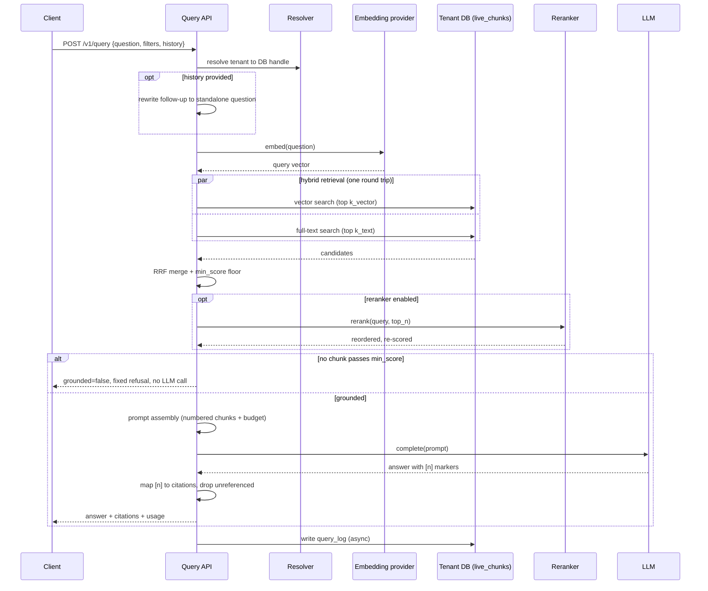

# SPEC-06: Retrieval and answering

**Implements:** FR-RET-01..10, NFR-PERF-01/02, NFR-REL-04 · **Decisions:** ADR-0004, ADR-0007, ADR-0051

## 1. Pipeline
```
question ─► embed(question) ─┬─► vector search  top k_vector ─┐
                             └─► full-text search top k_text ─┤─► RRF merge ─► filter floor ─► [rerank top_n] ─► top final_k
                                                                                                                │
           conversation history ─► question rewrite (optional) ──────────────────────────────────────────────────┘
                                                                                                                ▼
                                                                    prompt assembly ─► LLM ─► answer + citations ─► query_log
```



## 2. Hybrid SQL (single round trip)
The vector and full-text CTEs rank the `chunks` table directly, expressing liveness
as a semi-join on `version_id` (`version_id in (select current_version from documents
where status='active' …)`) rather than reading the `live_chunks` view. `version_id`
is globally unique, so this is **semantically identical** to `live_chunks` (only the
current version of an active document, SPEC-03 §2 Invariants 1–2) — but ranking over
the *view* forces the planner to resolve its `documents` join before the
`order by embedding <=> $1 limit $3`, which defeats the hnsw index and falls back to a
full Sort (≈180 ms at 50 k, seconds at 1 M — see §7). Filtering `chunks` directly lets
pgvector's iterative index scan drive the hnsw index and post-filter (ADR-0051). The
optional uri-prefix and metadata-tag document filters fold into the liveness subquery;
source and date range are chunk-column guards. Each filter is a `$n is null or …`
no-op when unset. `$1` embedding, `$2` source uuid[], `$3` k_vector, `$4` query text,
`$5` k_text, `$6` final k, `$7` uri LIKE pattern (escaped), `$8`/`$9` created_at
range, `$10` metadata jsonb.

The liveness + document-filter semi-join (below as `live(...)`) is inlined
identically in both CTEs rather than a shared CTE — a CTE referenced twice can be
materialised, which would change the plan away from the index scan.

```sql
-- live(...) := c.version_id in (
--   select d.current_version from documents d
--   where d.status = 'active'
--     and ($7::text  is null or d.uri like $7 escape '\')
--     and ($10::jsonb is null or d.metadata @> $10))
with v as (
  select c.id, row_number() over (order by c.embedding <=> $1::vector) as r
  from chunks c
  where live(...)
    and ($2::uuid[] is null or c.source_id = any($2))
    and ($8::timestamptz is null or c.created_at >= $8)
    and ($9::timestamptz is null or c.created_at <= $9)
  order by c.embedding <=> $1::vector limit $3
), t as (
  select c.id, row_number() over (order by ts_rank_cd(c.tsv, q) desc) as r
  from chunks c, websearch_to_tsquery('simple', $4) q
  where c.tsv @@ q and live(...)
    and ($2::uuid[] is null or c.source_id = any($2))
    and ($8::timestamptz is null or c.created_at >= $8)
    and ($9::timestamptz is null or c.created_at <= $9)
  order by ts_rank_cd(c.tsv, q) desc limit $5
), f as (
  select id, sum(1.0/(60+r)) as score from (select * from v union all select * from t) u group by id
)
select c.*, d.uri, d.title, f.score
from f join chunks c on c.id = f.id join documents d on d.id = c.document_id
order by f.score desc limit $6;
```
Per query, inside a read-only transaction, set (transaction-local, via
`set_config(…, true)` so they never leak to the pooled connection):
`hnsw.ef_search = max(40, k_vector)`; `hnsw.iterative_scan = strict_order` (candidates
in exact distance order so the fusion ranks are the true nearest-neighbour ranks); and
`plan_cache_mode = force_custom_plan`. The last is essential: the `$n is null or …`
filter guards defeat a *generic* prepared-statement plan (which pgx's statement cache
adopts after a few executions), which cannot prune the guards and abandons the hnsw
index — measured ~180 ms vs ~15 ms for the custom plan at 100 k chunks (ADR-0051). A
one-off EXPLAIN is always custom-planned, so it will not reveal this; the benchmark
measures real per-call latency.
**Requires pgvector ≥ 0.8** (iterative scan); on an older extension the query falls
back to full-sort latency, so the platform pins ≥ 0.8 and the `SET` fails loudly if it
is absent. The implementation (`internal/retrieve`) reaches the tenant DB only through
a `*tenant.DB` handle (ADR-0003); the query embedding ($1) is produced by the caller
(the query API, STORY-08.2), keeping retrieval embedding-provider agnostic.

## 3. Reranking
If `settings.reranker.enabled`, top `top_n` fused results go to `Reranker.Rerank(query, texts)`; final order by reranker score; `min_score` then applies to reranker score instead of fused score.

## 4. Grounding and refusal
If no chunk passes `min_score`, respond with `grounded=false`, a fixed message ("I couldn't find information about that in <tenant name>'s content."), zero citations, and still log the query. No LLM call is made.

## 5. Prompt assembly
- System: tenant name, instructions to answer only from provided sources, cite as `[n]`, say when unsure, match the user's language.
- Context: numbered chunks with `title > heading_path` header and `uri`, truncated to a token budget (default 6k).
- History: last N turns (default 6) if provided; optional rewrite step turns a follow-up into a standalone question before retrieval.
- Answer post-processing: map `[n]` markers to chunk IDs → citations `[{n, document_id, title, uri, heading_path, snippet}]`; unreferenced chunks are dropped from citations.

## 6. API contracts (see SPEC-07 for transport)
`POST /v1/query` request:
```json
{"question":"How do I reset the X200?","filters":{"source_ids":[],"uri_prefix":"https://docs.acme.com/"},
 "history":[{"role":"user","content":"..."},{"role":"assistant","content":"..."}],
 "stream":false,"top_k":8}
```
Response:
```json
{"id":"q_...","answer":"...","grounded":true,
 "citations":[{"n":1,"document_id":"...","title":"X200 manual","uri":"https://...","heading_path":["Reset"],"snippet":"..."}],
 "usage":{"retrieval_ms":120,"generation_ms":1400,"in_tokens":3200,"out_tokens":180},
 "model":"claude-sonnet-4-6"}
```
Streaming: SSE events `retrieval` (citations first), `delta` (text), `done` (usage).

## 7. Performance budget (p95, 1 M chunks)
embed question 80 ms · hybrid SQL 120 ms · rerank (optional) 250 ms · prompt build 5 ms · log write async. Total pre-generation ≤ 300 ms without rerank, ≤ 550 ms with.

The 120 ms hybrid-SQL budget assumes the query is index-backed: the hnsw index
(`chunks_embedding_idx`) for the vector CTE and the gin index (`chunks_tsv_idx`) for
the full-text CTE, with `hnsw.iterative_scan` enabled so the filtered
`order by <=> limit` uses the index instead of a full sort (§2, ADR-0051). Ranking
over the `live_chunks` view instead forces a full sort and blows the budget
(≈180 ms at 50 k, seconds at 1 M). STORY-08.1's benchmark (`internal/retrieve`
+ `test/e2e/retrieve_bench_test.go`) measures p95 and asserts the budget at 1 M; the
1 M figure is confirmed on production-class hardware (seeding 1 M is infeasible in
dev — the harness runs at the largest local scale and treats 1 M as a target,
never fabricating the number).

## 8. Evaluation harness
`ragctl eval run <slug> [--config file]` runs all `eval_cases`, records `eval_results`, prints recall@k (expected_doc_ids ∩ retrieved), grounded rate, LLM-judged correctness (optional), mean latency. Used as a gate before changing chunking/retrieval settings for a tenant.
