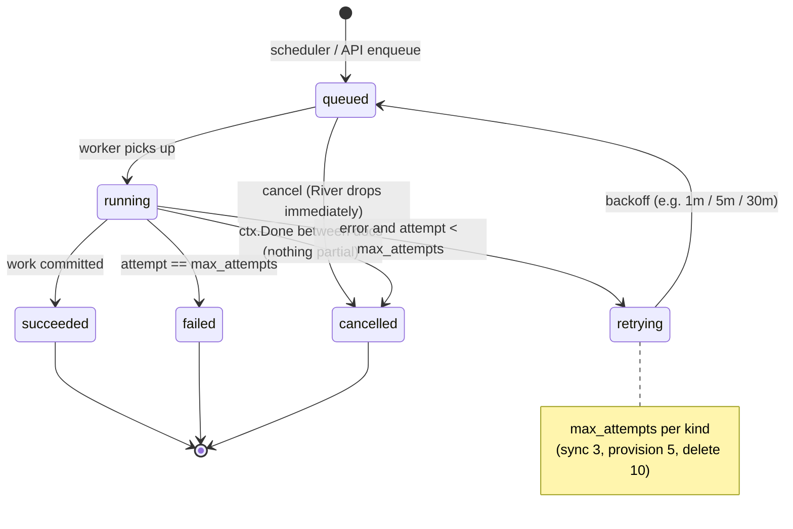

# SPEC-08: Jobs and scheduling

**Implements:** FR-ING-08, FR-SRC-11, FR-ADM-02, NFR-REL-02 · **Decisions:** ADR-0005

## 1. Job kinds
| Kind | Args | Queue | Uniqueness | Retries |
|---|---|---|---|---|
| sync_source | tenant_id, source_id, full | ingest | by source_id while queued/running | 3, backoff 1m/5m/30m |
| ingest_document | tenant_id, document_id, raw_ref | ingest | by document_id | 3 |
| reindex_tenant | tenant_id, new settings | maintenance | by tenant_id | 5, resumable cursor |
| provision_tenant | tenant_id | platform | by tenant_id | 5 |
| delete_tenant | tenant_id | platform | by tenant_id | 10 |
| delete_source | tenant_id, source_id | maintenance | by source_id | 5 |
| gc_tenant | tenant_id | maintenance | by tenant_id | 1, daily |
| eval_run | tenant_id, config | maintenance | — | 1 |

Queues have separate worker concurrency so a reindex cannot starve syncs. Per-tenant concurrency cap (default 2 ingest jobs) enforced via River's unique/partition features.

## 2. Scheduler
A leader-elected loop (advisory lock) every 30 s: `select ... from sources where status='active' and next_run_at <= now()` → enqueue `sync_source` (incremental; full every 7th run or per config) → compute `next_run_at` from `schedule_cron`. Also enqueues `gc_tenant` daily per active tenant.

## 3. Status mirroring
Worker middleware writes `jobs` row transitions (queued→running→succeeded/failed/cancelled) with `worker_id`, `attempt`, `stats`, `error`. Admin UI reads only `jobs`, never River internals.

## 4. Cancellation
`POST /v1/jobs/{id}/cancel` sets a flag; River cancels queued jobs immediately; running jobs observe `ctx.Done()` between documents and exit with status `cancelled`, committing nothing partial (SPEC-05 §5).

## 5. Observability
Metrics: queue depth per queue, job duration histogram per kind, failures per kind, per-tenant ingest throughput. Each job span carries tenant_id, job_id, source_id.
